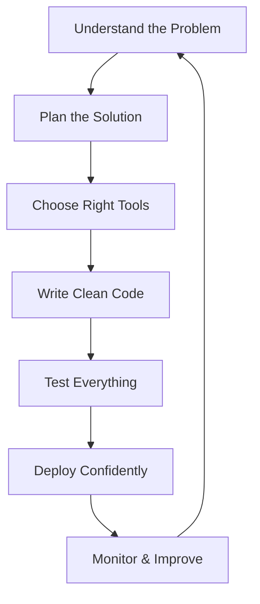

# Hey there! I'm Lenlo 👨‍💻

<div align="center">
  
</div>

<div align="center">
  
  
  
</div>

---

## 🚀 About Me (The Human Behind The Code)

```javascript
const developer = {
  name: "Raul Castillo",
  role: "Full-Stack Developer",
  location: "Antipolo City, Rizal 🇵🇭",
  education: "Computer Science Graduate",
  experience: "Building digital solutions that users actually love",
  
  techStack: {
    frontend: ["React.js", "HTML5", "CSS3", "Tailwind CSS", "JavaScript ES6+"],
    backend: ["Node.js", "Express.js", "PHP", "Laravel", "RESTful APIs"],
    database: ["MongoDB", "PostgreSQL", "MySQL", "Redis"],
    cloud: ["AWS", "Docker", "CI/CD", "Linux"]
  },
  
  workingStyle: {
    motto: "Clean code is not written by following rules. It's written by someone who cares.",
    approach: "Test-driven development meets user-centered design",
    communication: "Clear, frequent, and honest",
    problemSolving: "Break it down, build it up, make it beautiful"
  },
  
  currentMission: "Creating web applications that solve real problems elegantly",
  superpower: "Turning complex business requirements into intuitive user experiences",
  weaknesses: ["Can't resist refactoring legacy code", "Perfectionist with UI details"],
  
  whenNotCoding: ["Exploring new tech", "Reading about system design", "Playing guitar"],
  coffeeConsumption: "Probably too much ☕"
};

// Always evolving, always learning
developer.futureGoals = ["Microservices architecture", "DevOps mastery", "Team leadership"];
```

**What I Bring to Your Team:**
- 💡 **Problem-First Thinking** - I don't just code; I solve business problems
- 🎯 **Full-Stack Vision** - From database optimization to pixel-perfect UIs
- 🔄 **Adaptable Tech Stack** - Whether it's React + Node.js or Laravel + React, I deliver
- 📈 **Growth Mindset** - Every project teaches me something new
- 🤝 **Collaborative Spirit** - Great software is built by great teams

---

## 🛠️ My Tech Arsenal (Weapons of Choice)

<div align="center">

### 🎨 Frontend Mastery


### ⚙️ Backend Power


### 🗄️ Database Expertise


### ☁️ Cloud & DevOps


### 🔧 Development Tools


</div>

---

## 💼 What I Can Build For You

### 🎯 **MERN Stack Applications**
- **E-commerce Platforms** - Full shopping experiences with payment integration
- **Social Media Apps** - Real-time chat, notifications, and user interactions
- **Dashboard & Analytics** - Data visualization and business intelligence tools
- **Content Management** - Custom CMS solutions tailored to your workflow

### 🎯 **PHP/Laravel Solutions**
- **Enterprise Web Applications** - Scalable business solutions with Laravel
- **API Development** - RESTful services with proper authentication & documentation
- **Legacy System Modernization** - Breathing new life into old PHP applications
- **Custom Web Portals** - Client portals, admin panels, and workflow management

### 🎯 **Full-Stack Integration**
- **Hybrid Applications** - Laravel backend with React frontend (best of both worlds)
- **Microservices Architecture** - Breaking monoliths into manageable services
- **Third-party Integrations** - Payment gateways, social logins, external APIs
- **Performance Optimization** - Making your applications lightning fast

---

## 📊 GitHub Analytics

<div align="center">
  
  
</div>

<div align="center">
  
</div>

---

## 🎯 My Development Philosophy



**My Core Principles:**

🎨 **User-Centered Design** - If users don't love it, it's not done  
⚡ **Performance Matters** - Every millisecond counts in user experience  
🔧 **Maintainable Code** - Future developers (including me) will thank us  
🧪 **Test-Driven** - Confidence comes from comprehensive testing  
📚 **Documentation First** - Good docs save more time than good code  
🔄 **Continuous Learning** - Yesterday's best practices are tomorrow's legacy code  

---

## 🚀 Current Learning Journey

- [ ] **Next.js 15** - Mastering the latest React framework features
- [ ] **Laravel 11** - Exploring new PHP 8.3+ features and performance improvements
- [ ] **TypeScript Advanced Patterns** - Generic wizardry and type gymnastics
- [ ] **Docker & Kubernetes** - Container orchestration for scalable deployments
- [ ] **AWS Solutions Architecture** - Cloud-native application design
- [ ] **GraphQL** - Modern API development with Apollo
- [ ] **React Native** - Expanding into mobile development

---

## 💡 What Makes Me Different

**🎯 Business-First Approach**  
I don't just implement features; I understand why they matter to your business and users.

**🛠️ Technology Agnostic**  
Whether your team prefers Laravel or Node.js, I adapt to what works best for your project.

**📈 Scalability Minded**  
I build applications that grow with your business, not against it.

**🤝 Communication Focused**  
Regular updates, clear documentation, and honest timelines. No surprises, just results.

**🔍 Detail Oriented**  
From API response times to button padding, I sweat the small stuff so you don't have to.

---

## 📈 Contribution Visualization

<div align="center">
  
</div>

---

## 📫 Let's Build Something Amazing Together!

<div align="center">
  
[](https://linkedin.com/in/raulc8808)
[](mailto:raulc8808@gmail.com)
[](https://lenlo121500.github.io/lenlodev-portfolio)
[](https://github.com/lenlo121500)

**📞 Available for:** Full-time positions | Freelance projects | Technical consulting  
**🌍 Remote-ready** | **🇵🇭 Based in Philippines** | **🕒 Flexible timezone**

</div>

---

<div align="center">
  
</div>

<div align="center">
  
**"Code is like humor. When you have to explain it, it's bad." – Cory House**

*Ready to turn your ideas into digital reality. Let's build something that matters.* 🚀

---

</div>

---

<div align="center">
  
</div>
