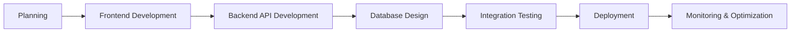

# Hi there, I'm Lenlo 👋

<div align="center">
  
</div>

<div align="center">
  
  
</div>

---

## 🚀 About Me

```javascript
const developer = {
  name: "Raul Castillo",
  role: "MERN Stack Developer",
  location: "Antipolo City, Rizal",
  education: "Computer Science Graduate",
  currentFocus: "Building scalable full-stack web applications",
  specialization: [
    "Frontend: HTML, CSS, React.js",
    "Backend: Node.js, Express.js, RESTful APIs",
    "Database: MongoDB, PostgreSQL, Redis",
    "DevOps: Docker, AWS, CI/CD"
  ],
  funFact: "I can optimize database queries for hours and love every minute of it! 😄",
  passion: "Creating seamless user experiences from database to UI"
};

console.log(developer);
```

- 🔭 I'm currently working on **building scalable full-stack MERN applications and RESTful APIs**
- 🌱 I'm currently learning **Next.js, TypeScript, Microservices architecture, Docker containerization, and AWS cloud services**
- 👯 I'm looking to collaborate on **full-stack web applications, API projects, and database optimization**
- 💬 Ask me about **MERN Stack, React.js, Node.js, Express.js, MongoDB, Database Design, and API Development**
- 📫 How to reach me: **raulc8808@gmail.com**
- ⚡ Fun fact: **I can spend hours optimizing a single database query and creating pixel-perfect UI components**

---

## 🛠️ MERN Stack Tech Arsenal

<div align="center">

### Frontend Technologies


### Backend Technologies


### Databases & Storage


### Cloud & DevOps


### Tools & Technologies


</div>

---

## 🎯 Full-Stack Specializations

### 🎨 Frontend Development
- **React.js Ecosystem** - Components, Hooks, Context API, and modern patterns
- **State Management** - Zustand, and Context API implementations
- **UI/UX Development** - Responsive design with Tailwind CSS
- **Performance Optimization** - Code splitting, lazy loading, and SEO optimization
- **Modern JavaScript** - ES6+, TypeScript, and asynchronous programming

### ⚙️ Backend Development
- **RESTful API Development** - Building scalable and maintainable APIs
- **Database Design & Optimization** - Efficient schema design and query optimization
- **Authentication & Authorization** - JWT, OAuth, and security best practices
- **Microservices Architecture** - Designing distributed systems
- **Server-Side Performance** - Caching strategies and optimization techniques

### 🔧 Full-Stack Integration
- **API Integration** - Seamless frontend-backend communication
- **Real-time Features** - WebSocket implementation with Socket.io
- **File Management** - Upload, processing, and storage solutions
- **Testing** - Unit testing, integration testing, and E2E testing
- **DevOps & Deployment** - CI/CD pipelines and cloud deployment strategies

---

## 📊 GitHub Stats

<div align="center">
  
  
</div>

<div align="center">
  
</div>

---

## 📈 Contribution Graph

<div align="center">
  
</div>

## 🎯 Current Learning Goals

- [ ] Master Next.js 15 with App Router and Server Components
- [ ] Deep dive into TypeScript advanced patterns and generics
- [ ] Implement GraphQL with Apollo Server and Client
- [ ] Learn React Native for mobile development
- [ ] Master Docker containerization and Kubernetes orchestration
- [ ] Get AWS Solutions Architect certification
- [ ] Explore serverless architecture with AWS Lambda and Vercel Functions

---

## 🔧 Development Workflow



**My Development Process:**
1. **Planning & Design** - Wireframing and system architecture
2. **Frontend Development** - React components and user interface
3. **Backend Development** - API endpoints and business logic
4. **Database Integration** - Schema design and data management
5. **Testing & Quality Assurance** - Unit tests and integration tests
6. **Deployment & DevOps** - CI/CD pipelines and cloud deployment
7. **Monitoring & Optimization** - Performance tracking and improvements

---

## 📫 Let's Connect!

<div align="center">
  
[](https://linkedin.com/in/raulc8808)
[](mailto:raulc8808@gmail.com)
[](https://lenlo121500.github.io/lenlodev-portfolio)
[](https://github.com/lenlo121500)

</div>

---

<div align="center">
  
</div>

<div align="center">
  
**"The best way to learn is to build something you're passionate about." – Unknown**

*Building full-stack applications that solve real-world problems, one commit at a time.* 🚀

</div>

---

<div align="center">
  
</div>
